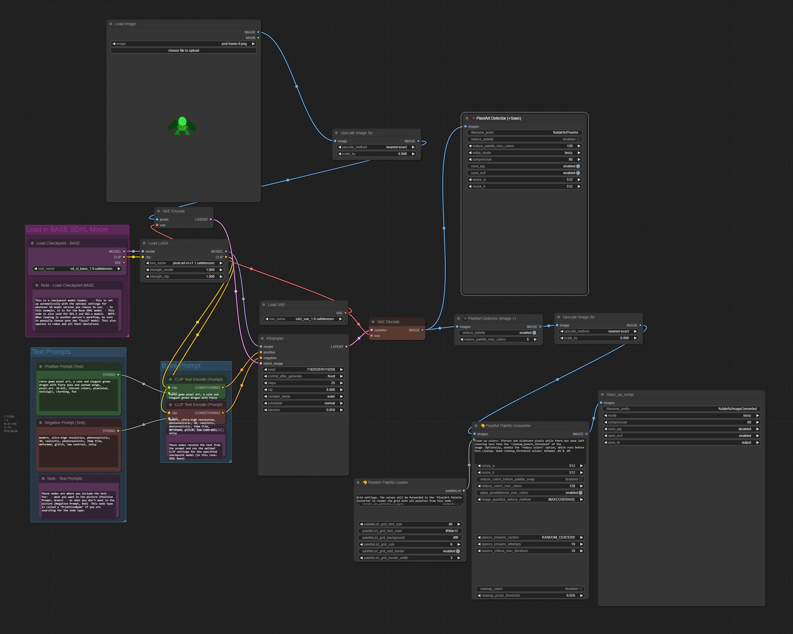
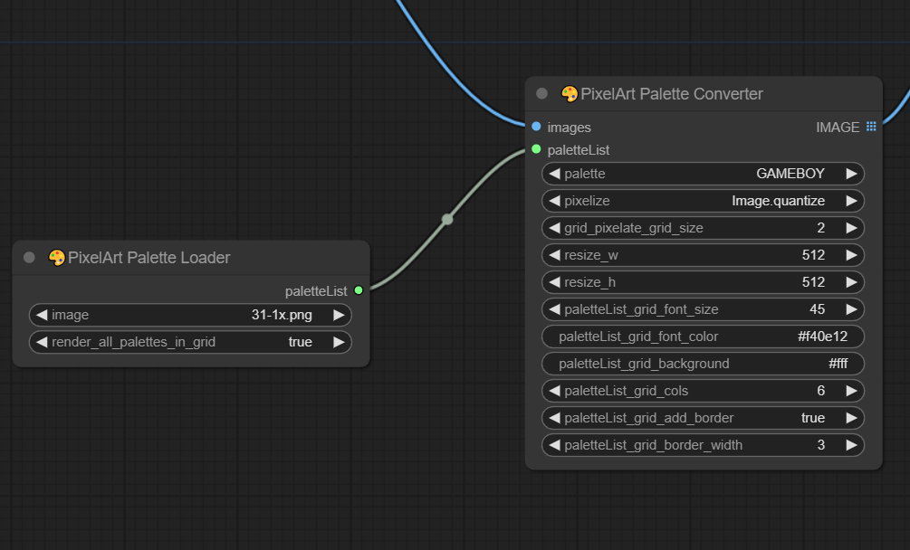
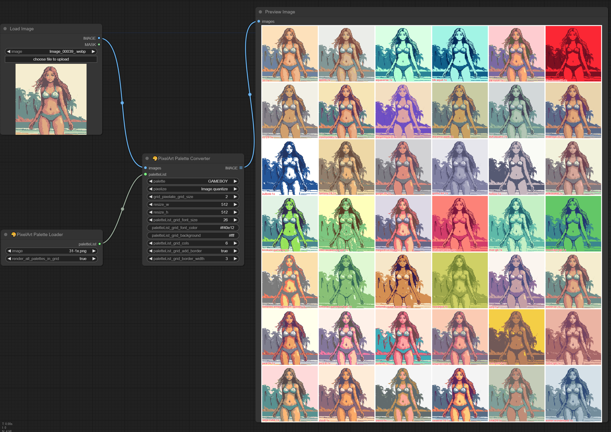
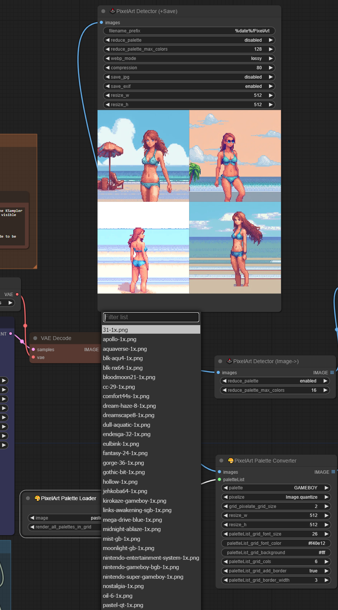
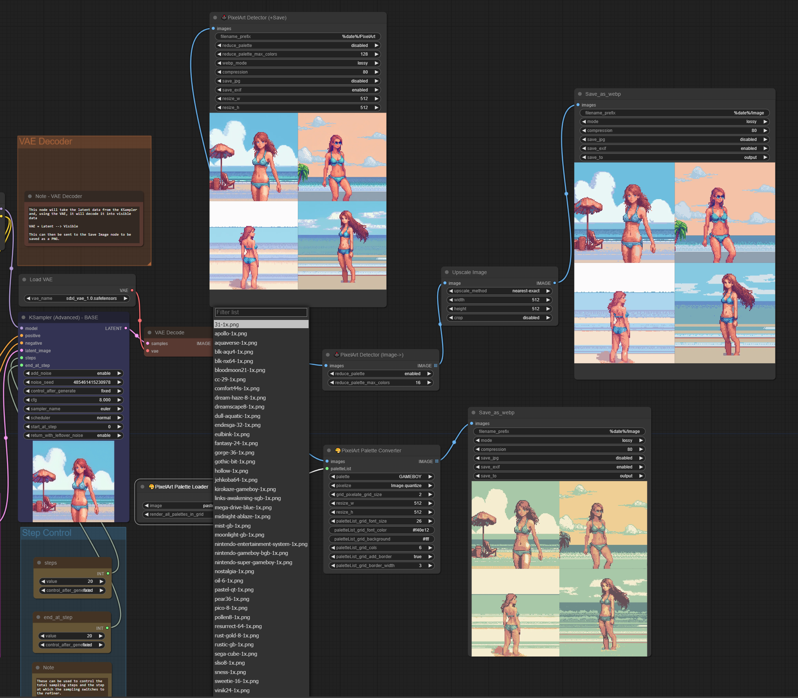

# ComfyUI PixelArt Detector v1.2
Generate, downscale, change palletes and restore pixel art images with SDXL.

    

    

    

Save a picture as Webp (+optional JPEG) file in Comfy + Workflow loading.

**Update 1.2**: PixelArtDetectorConverter will upscale the image if the input image is smaller than the resize sizes.

**Update 1.1**: changed the default workflow.json to use the default "Save Image" node. workflow_webp.json will be using the webp node.

> [!IMPORTANT]
> If you have an older version of the nodes, delete the node and add it again. Location of the nodes: "Image/PixelArt". I've added some example workflow in the workflow.json. The example images might have outdated workflows with older node versions embedded inside.

## Description:
Pixel Art manipulation code based on: https://github.com/Astropulse/pixeldetector

This adds 4 custom nodes:
* __PixelArt Detector (+Save)__ - this node is All in One reduce palette, resize, saving image node
* __PixelArt Detector (Image->)__ - this node will downscale and reduce the palette and forward the image to another node
* __PixelArt Palette Converter__ - this node will change the palette of your input. There are a couple of embedded palettes. Use the Palette Loader for more
* __PixelArt Palette Loader__ - this node comes with a lot of custom palettes which can be an input to the PixelArt Palette Converter "paletteList" input. Optional GRIDS preview of all palettes

The plugin also adds a script to Comfy to drag and drop generated webp|jpeg files into the UI to load the workflows.

The nodes are able to manipulate the pixel art image in ways that it should look pixel perfect (downscales, changes palette, upscales etc.).

> [!IMPORTANT]
> You can disable the embedded resize function in the nodes by setting W & H to 0.

## Installation:

To use these nodes, simply open a terminal in **ComfyUI/custom_nodes/** and run:

```
git clone https://github.com/dimtoneff/ComfyUI-PixelArt-Detector
```

I am using a "Save_as_webp" node to save my output images (check the workflow_webp.json). You can find my customization in the following repo (part of the workflow).

Just execute this command in **ComfyUI/custom_nodes/** too.

```
git clone https://github.com/dimtoneff/ComfyUI-Saveaswebp
```

Original "Save_as_webp" node repo: https://github.com/Kaharos94/ComfyUI-Saveaswebp.

If you don't want to use "Save_as_webp" nodes, just delete them from my workflow in **workflow_webp.json** and add the default "Save Image" node to save as PNG (or use the default **workflow.json**)

Restart ComfyUI afterwards.

# Usage

Use LoRa: https://civitai.com/models/120096/pixel-art-xl

Drag the workflow.json file in your ComfyUI

Set the resize inputs to 0 to disable upscaling in the "Save" node.

Reduce palettes or completely exchange palettes on your images.

## text2image

**Positive prompt**: pixelart, {your scene}, pixel-art. low-res, blocky, pixel art style, 8-bit graphics, sharp details, less colors, early computer game art

**Negative prompt**: sloppy, messy, blurry, noisy, highly detailed, ultra textured, photo, realistic, high-resolution, photo-realistic

 
 


## image2image

on a pixel drawing converting to a pixel asset for finetuning:

Input:


Output:


Workflow WEBP (drag & drop):


Feel free to experiment!

Other image2image examples:
https://github.com/dimtoneff/ComfyUI-PixelArt-Detector/issues/2

### Extra info about the "PixelArt Detector (+Save)" Node:

There is a compression slider and a lossy/lossless option for webp. The compression slider is a bit misleading.

In lossless mode, it only affects the "effort" taken to compress where 100 is the smallest possible size and 1 is the biggest possible size, it's a tradeoff for saving speed.

In lossy mode, that's the other way around, where 100 is the biggest possible size with the least compression and 1 is the smallest possible size with maximum compression.

There is an option to save a JPEG alongside the webp file.

### Extra info about the "PixelArt Palette Converter" Node:

The grid_pixelate_grid_size option is for the pixelize grid.Pixelate option. Size of 1 is pixel by pixel. Very slow. Increazing the size improves speed but kills quality. Experiment or not use that option.

### Extra info about the "PixelArt Palette Converter" and "PixelArt Palette Loader" Nodes:

Included palettes from: https://lospec.com/palette-list

> [!IMPORTANT]
> If you like some palette, download the 1px one and add it to the **"ComfyUI-PixelArt-Detector\palettes\1x"** directory.

**GRIDS**

* Connect the __PixelArt Palette Loader__ to the __PixelArt Palette Converter__ or use the "grid.json" file and drag&drop into ComfyUI
* enable the render_all_palettes_in_grid
* use the default "Preview Image" node to preview the grids (preferably)
* play with the settings




**Community examples:**

      

     

      

     

     

     


# Screenshots

Nodes:



Workflow view:



**Here are some palette change examples:**

 

 

 

 

 

# Examples

Normal image:

 

Reduced palette:

 

 

Upscaled:


# Credits
Big thanks to https://github.com/Astropulse/pixeldetector for the main code.

Big thanks to https://github.com/Kaharos94/ComfyUI-Saveaswebp for the webp saving code.

Big thanks to https://github.com/paultron for numpy-ifying the downscale calculation and making it tons faster.

Big thanks to https://lospec.com/palette-list and the creators of the awesome palettes.
