# ComfyUI PixelArt Detector v1.7.3

Generate, downscale, change palletes and restore pixel art images with SDXL.

 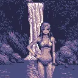 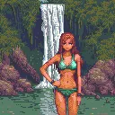 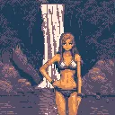 

    

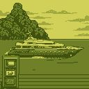    

Save a picture as Webp (+optional JPEG) file in Comfy + Workflow loading.

**Update 1.7.3**:

* Added install for prebuilt pyclustering library

**Update 1.7.2**:

* Updated all the workflows
* Added a lot of new palettes

**Update 1.7.0**:

All changes maintain backward compatibility while providing users **with more control over image resizing behavior**:

* Added a wrapper for the Astropulse's algo making sure no distortions happen with uncommon ARs by enforcing a single uniform factor, the geometry is preserved and no axis is stretched differently
* Added a reusable resize_image function in pixelUtils.py that supports three resize modes:
  * "contain": Maintains aspect ratio with shrinking and fits within specified dimensions (default)
  * "fit": Maintains aspect ratio but crops to fill entire area
  * "stretch": Stretches to exact dimensions, may distort image in uncommon aspect ratios
* Updated `PixelArtDetectorConverter`, `PixelArtDetectorConverter` and `PixelArtDetectorSave` classes to use the new resize_image function

**Update 1.6.1**:

* **Node Frontend Improvements**:
  * `PixelArtLoadPalettes`: now has a preview of the palettes. Changing the palette triggers a preview of the unique palette colors in the node without a workflow run
  * `PixelArtLoadPalettes`: implemented dynamic widget show/hide logic for the grid settings.

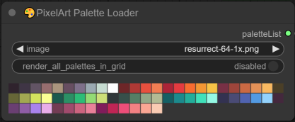

**Update 1.6.0**:

* **Refactored `PixelArtDetectorConverter` node**:
  * Separated quantization methods from reducing methods.
  * Fixed dithering.
  * Added more dynamic widget show/hide logic.
* **Workflow Updates**:
  * Updated and moved all workflows to `example_workflows` directory.
  * Added images for workflows.
  * Added a new workflow for the new `PixelArtPaletteGenerator` node
* **Compatibility & Dependencies**:
  * Compatible with ComfyUI v0.3.49.
  * Bumped some requirements versions and fixed numpy versioning error.
  * Adjusted Javascript files according to the new ComfyUI frontend.
* **New Node**:
  * Introduced `PixelArtPaletteGenerator` for generating palettes from images Thanx @za-wa-n-go

**Update 1.5.2**:

* Fixed the compatibility with Python <3.10
* Fixed a scipy 'signal' error

**Update 1.5.1**: @tsone added a new dithering node: **PixelArtAddDitherPattern**

* with prepared patterns
* with custom patterns from a mask
* also added a b&w palette


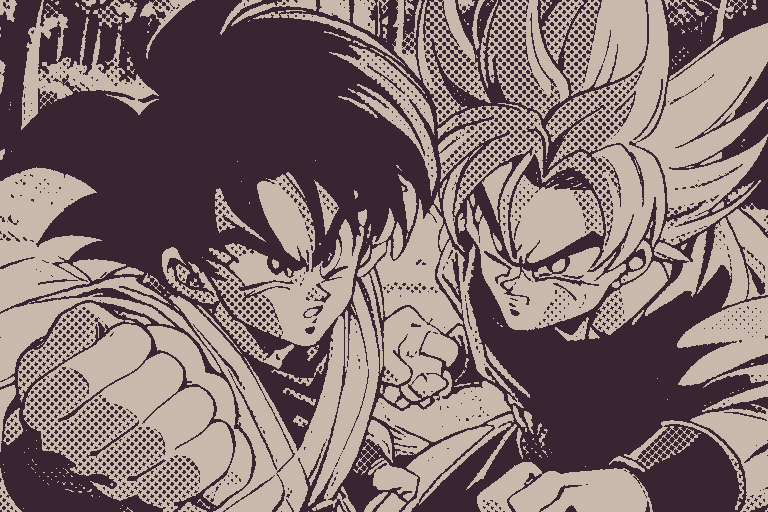

**Update 1.5**: Maintenance & Dithering + bugfixes

* **added dithering**
* made the node compatible with **Pillow < 10 & Pillow > 10**
* fixed an issue where changing the fontSize in grids did not work
* fixed an issue with Pillow library and ImageDraw.textsize not available in Pillow>= 10.0
* fixed an issue with text too long in Grids
* fixed an issue with the NP.quantize method

Dithering examples:

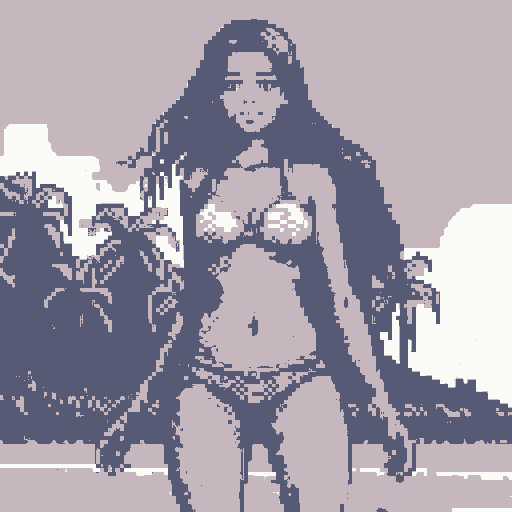 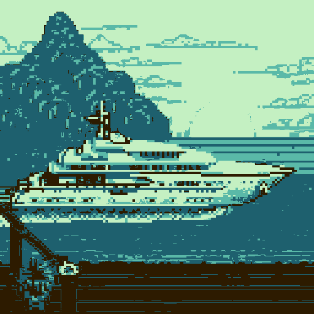

**Update 1.4**: Added a check and installation for the opencv (cv2) library used with the nodes. This should fix the reported issues people were having.

**Update 1.3**: Updated all 4 nodes. Please, pull this and exchange all your PixelArt nodes in your workflow. Mind the settings.

* added OpenCV.kmeans algo to reduce colors in an image. Working only when reducing colors.
* added "clean up" pixels function which uses Image.quantize to iterate over the image and eliminate colors based on given threshold. Runs after optional reducing of colors step
* added different algos to reduce image with Image.quantize method (default one). MEDIANCUT, MAXCOVERAGE etc. MAXCOVERAGE seems to produce cleaner pixel art. FASTOCTREE is fast and bad
* updated choices to BOOLEANs and toggles
* added the "NP.quantize" method using fast numpy arrays to reduce and exchange palettes
* moved out the grid settings from the Palette Converter to the Palette Loader
* and many other small additions

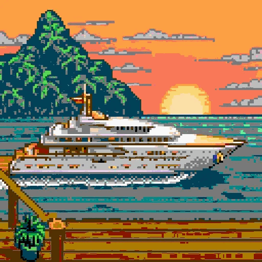

**Update 1.2**: PixelArtDetectorConverter will upscale the image BEFORE the pixelization/quantization process if the input image is smaller than the resize sizes. If bigger, it will downscale after
quantization.

**Update 1.1**: changed the default workflow.json to use the default "Save Image" node. workflow_webp.json will be using the webp node.

> [!IMPORTANT]
> If you have an older version of the nodes, delete the node and add it again. Location of the nodes: "Image/PixelArt". I've added some example workflow in the workflow.json. The example images might
> have outdated workflows with older node versions embedded inside.

## Description:

Pixel Art manipulation code based on: https://github.com/Astropulse/pixeldetector

This adds 6 custom nodes:

* __PixelArt Detector (+Save)__ - this node is All in One reduce palette, resize, saving image node
* __PixelArt Detector (Image->)__ - this node will downscale and reduce the palette and forward the image to another node
* __PixelArt Palette Converter__ - this node will change the palette of your input. There are a couple of embedded palettes. Use the Palette Loader for more
* __PixelArt Palette Loader__ - this node comes with a lot of custom palettes which can be an input to the PixelArt Palette Converter "paletteList" input. Optional GRIDS preview of all palettes
* __PixelArt Palette Generator__ - this node generates a color palette from an input image.
* __PixelArtAddDitherPattern__ - this node adds a dither pattern to the image.

The plugin also adds a script to Comfy to drag and drop generated webp|jpeg files into the UI to load the workflows.

The nodes are able to manipulate the pixel art image in ways that it should look pixel perfect (downscales, changes palette, upscales etc.).

> [!IMPORTANT]
> You can disable the embedded resize function in the nodes by setting W & H to 0.

## Installation:

To use these nodes, simply open a terminal in **ComfyUI/custom_nodes/** and run:

```
git clone https://github.com/dimtoneff/ComfyUI-PixelArt-Detector
```

I am using a "Save_as_webp" node to save my output images (check the workflow_webp.json). You can find my customization in the following repo (part of the workflow).

Just execute this command in **ComfyUI/custom_nodes/** too.

```
git clone https://github.com/dimtoneff/ComfyUI-Saveaswebp
```

Original "Save_as_webp" node repo: https://github.com/Kaharos94/ComfyUI-Saveaswebp.

If you don't want to use "Save_as_webp" nodes, just delete them from my workflow in **workflow_webp.json** and add the default "Save Image" node to save as PNG (or use the default **workflow.json**)

Restart ComfyUI afterwards.

### New node: "PixelArt Palette Generator"

This node can generate a color palette from a given image. You can specify the number of colors and the layout of the generated palette image.

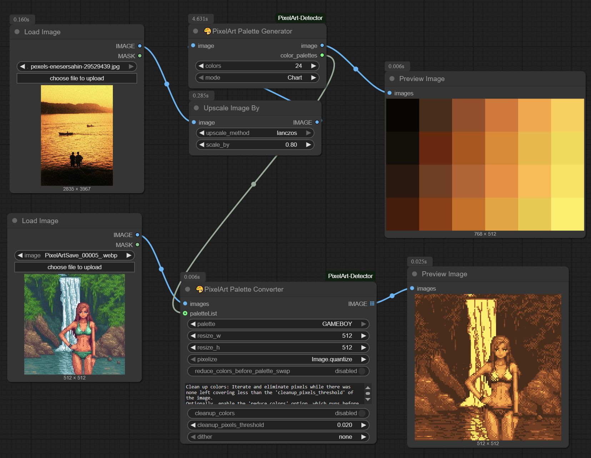

### Extra info about the "PixelArt Palette Generator" Node:

* **colors**: The number of colors to be generated in the palette.
* **mode**: The layout of the generated palette image.
    * **Chart**: A grid layout for the colors.
    * **back_to_back**: A horizontal strip of colors.

The node outputs an image of the palette and a list of colors that can be used with the `PixelArt Palette Converter` node.

# Usage

Use LoRa: https://civitai.com/models/120096/pixel-art-xl

Drag the workflow.json file in your ComfyUI

Set the resize inputs to 0 to disable upscaling in the "Save" node.

Reduce palettes or completely exchange palettes on your images.

## text2image

**Positive prompt**: pixelart, {your scene}, pixel-art. low-res, blocky, pixel art style, 8-bit graphics, sharp details, less colors, early computer game art

**Negative prompt**: sloppy, messy, blurry, noisy, highly detailed, ultra textured, photo, realistic, high-resolution, photo-realistic

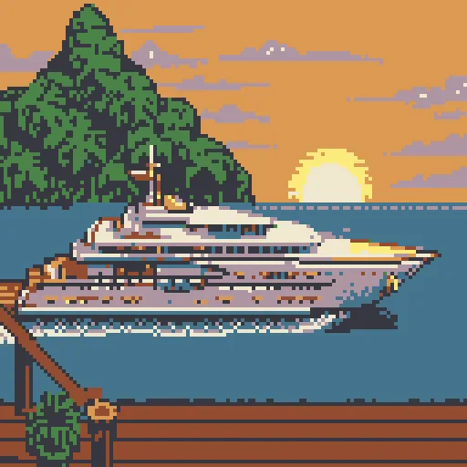 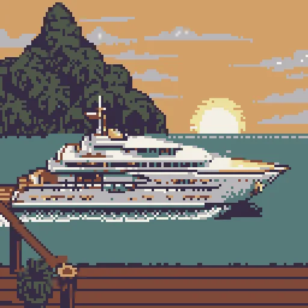
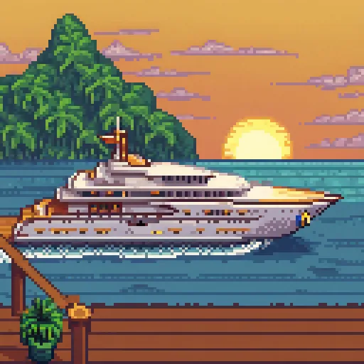 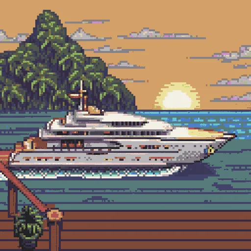
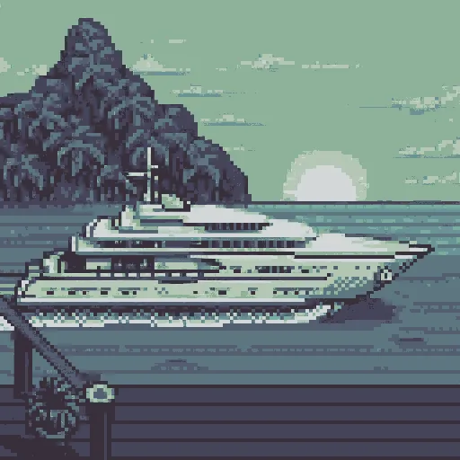

## image2image

on a pixel drawing converting to a pixel asset for finetuning:

Input:

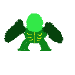

Output:

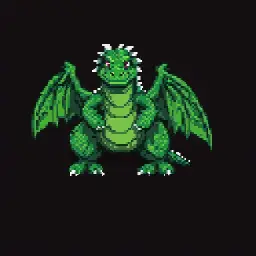


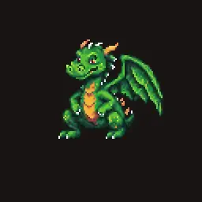

Feel free to experiment!
Free web tool for pixel art: https://www.pixilart.com/draw

Other image2image examples:
[Discussion in the issues](https://github.com/dimtoneff/ComfyUI-PixelArt-Detector/issues/2)

### Extra info about the "PixelArt Detector (+Save)" Node:

There is a compression slider and a lossy/lossless option for webp. The compression slider is a bit misleading.

In lossless mode, it only affects the "effort" taken to compress where 100 is the smallest possible size and 1 is the biggest possible size, it's a tradeoff for saving speed.

In lossy mode, that's the other way around, where 100 is the biggest possible size with the least compression and 1 is the smallest possible size with maximum compression.

There is an option to save a JPEG alongside the webp file.

### Extra info about the "PixelArt Palette Converter" Node:

* **palette**: a couple of retro palettes used if the paletteList input is not used
* **pixelize**: here we have different algos to reduce colors & replace palettes
    * **Image.quantize**: uses PIL Image functions to reduce colors & replace palettes. You can change the reduce algo with **"image_quantize_reduce_method"**
    * **Grid.pixelate**: a custom algo to exchange palettes. Slow when **grid_pixelate_grid_scan_size** is 1
    * **NP.quantize**: a custom algo to exchange paletes. Using fast numpy arrays. Slower than Image.quantize
* **grid_pixelate_grid_scan_size** option is for the pixelize grid.Pixelate option. Size of 1 is pixel by pixel. Very slow. Increasing the size improves speed but kills quality. Experiment or not use
  that option.
* **resize_w** & **resize_h**: it will downscale or upscale the end result to these sizes
* **reduce_colors_before_palette_swap**: it's going to reduce colors with either Image.quantize or one of the other algos.
* **reduce_colors_method**: The algorithm to use for color reduction.
    * **Image.quantize**: uses PIL Image functions to reduce colors. Fast.
    * **OpenCV.kmeans.reduce**: using the OpenCV library to reduce colors. It is slow but good when attempts & iterations are higher. You can change the way it picks colors with the option **"opencv_kmeans_centers"**.
    * **Pycluster.kmeans.reduce**: using the Pyclustering library to reduce colors with the K-Means algorithm.
    * **Pycluster.kmedians.reduce**: using the Pyclustering library to reduce colors with the K-Medians algorithm.
* **reduce_colors_max_colors**: the colors count to reduce the image to
* **apply_pixeldetector_max_colors**: use the Astropulse's PixelDetector to grab the max dominant colors.
* **image_quantize_reduce_method**: the method used from Image.quantize pixelize option to reduce colors. MAXCOVERAGE seems good for pixel art. But try the rest too.
* **opencv_kmeans_centers**: a flag how to pick the labels/colors. RANDOM is.. random. Interesting results. Increasing attempts makes it slower but picks the best colors.
    * **KMEANS_RANDOM_CENTERS**: it always starts with a random set of initial samples, and tries to converge from there depending upon TermCriteria. Fast but doesn't guarantee same labels for the
      exact same image. Needs more "attempts" to find the "best" labels
    * **KMEANS_PP_CENTERS**: it first iterates the whole image to determine the probable centers and then starts to converge. Slow but will yield optimum and consistent results for same input image.
* **opencv_kmeans_attempts**: how many times to attempt finding the best colors to reduce the image to
* **opencv_criteria_max_iterations**: how many iterations per attempt
* **pycluster_kmeans_metrics**: The metric to use for Pycluster algorithms.
* **cleanup_colors**: given a threshold, iterate over the image and eliminate less used colors. May be combined with the **reduce_colos_before_palette_swap** option for optimal clean up. Or optimal
  break of the image :)
* **cleanup_pixels_threshold**: the threshold for the cleanup function. Good values: 0.01-0.05. If it eliminates too much, lower the value. **LOWER VALUE = MORE COLORS**
* **dither**: apply dithering for more "retro" look

### Extra info about the "PixelArt Palette Converter" and "PixelArt Palette Loader" Nodes:

Included palettes from: https://lospec.com/palette-list

> [!IMPORTANT]
> If you like some palette, download the 1px one and add it to the **"ComfyUI-PixelArt-Detector\palettes\1x"** directory.

**GRIDS**

* Connect the __PixelArt Palette Loader__ to the __PixelArt Palette Converter__ or use the "grid.json" file and drag&drop into ComfyUI
* enable the render_all_palettes_in_grid
* use the default "Preview Image" node to preview the grids (preferably)
* play with the settings

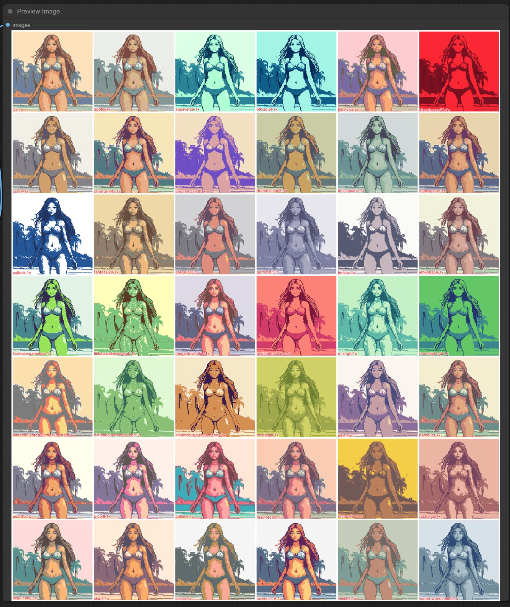

**Community examples:**

     

 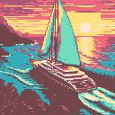   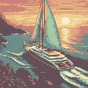 

  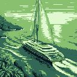   

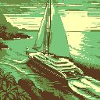 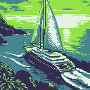    

     

     

# Screenshots

Nodes:

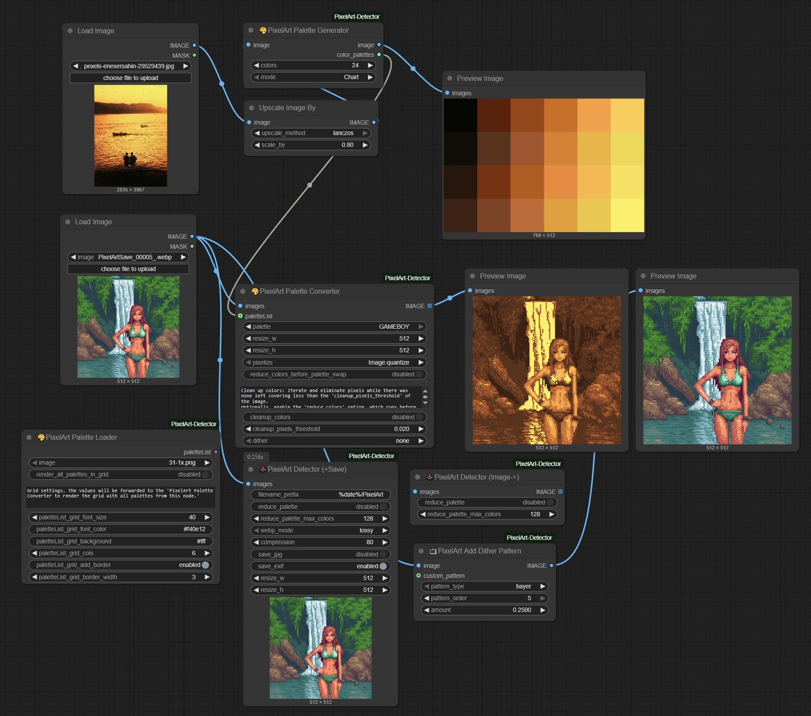

Workflow view:


**Here are some palette change examples:**

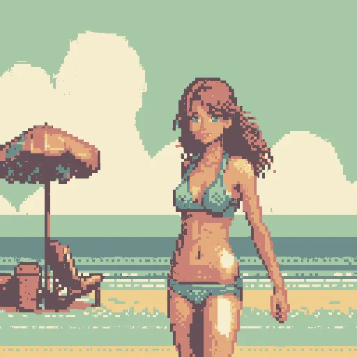 

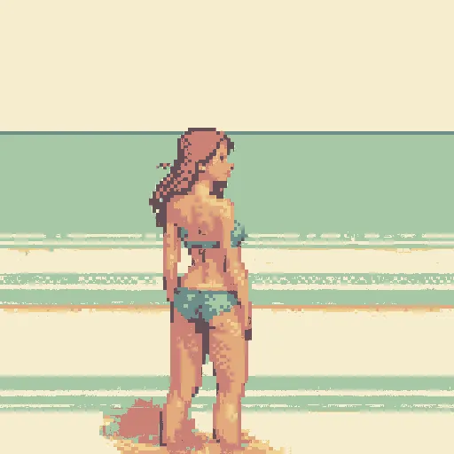 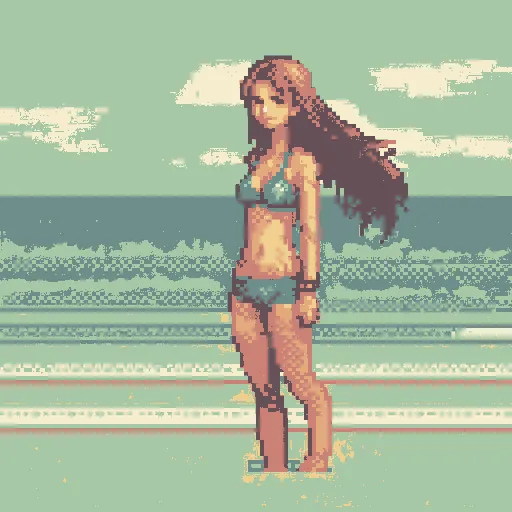

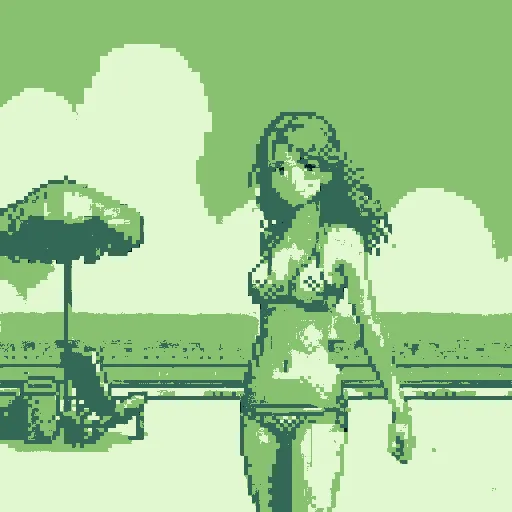 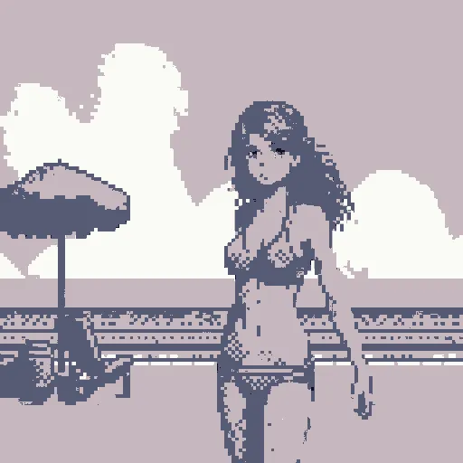

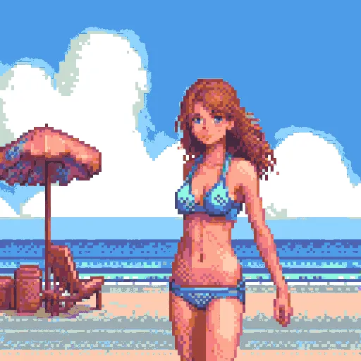 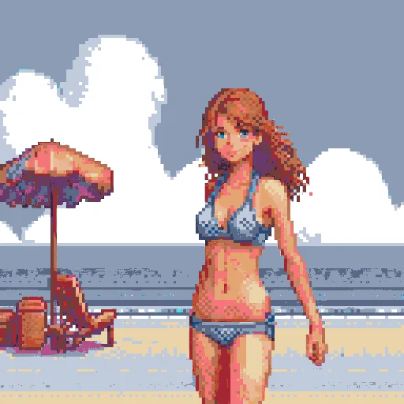

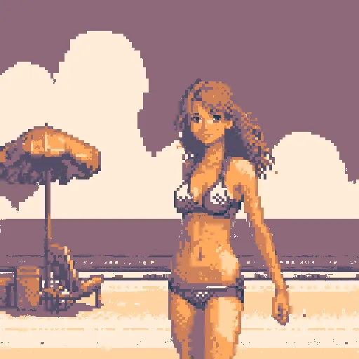 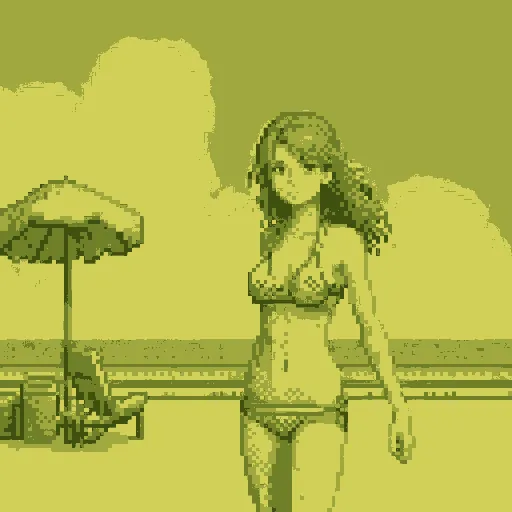

# Examples

Normal image:

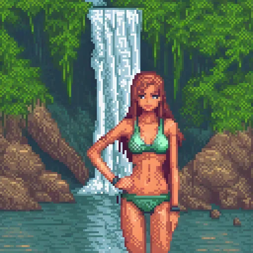 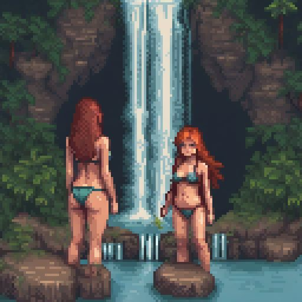

Reduced palette:

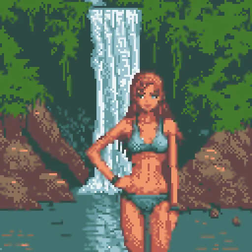 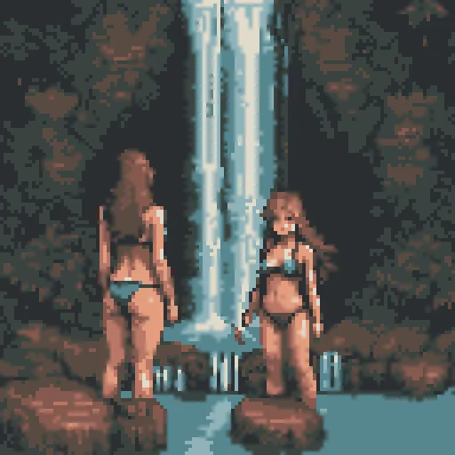

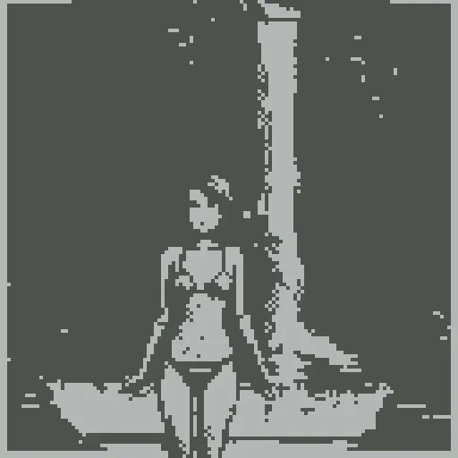 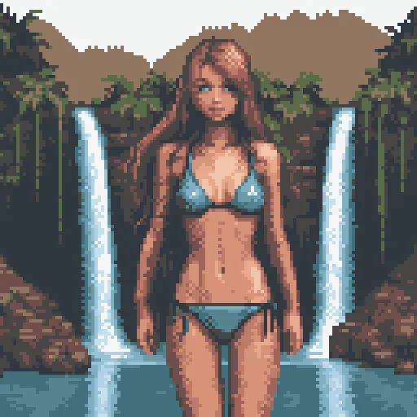

Upscaled:


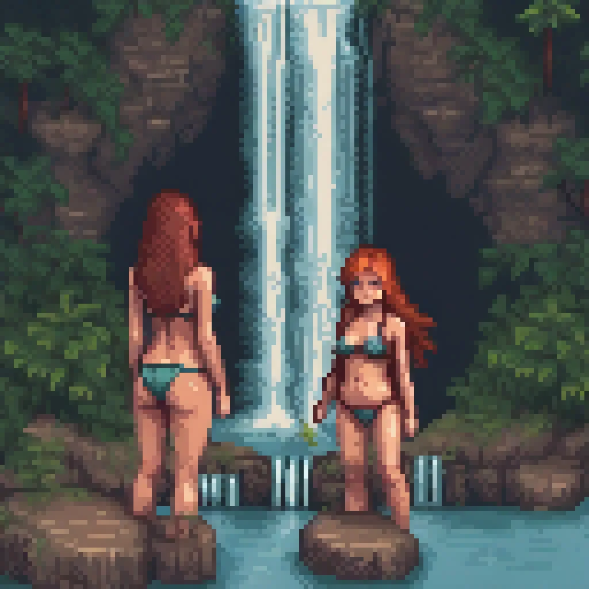

# Credits

Big thanks to https://github.com/Astropulse/pixeldetector for the main code.

Big thanks to https://github.com/Kaharos94/ComfyUI-Saveaswebp for the webp saving code.

Big thanks to https://github.com/paultron for numpy-ifying the downscale calculation and making it tons faster.

Big thanks to https://lospec.com/palette-list and the creators of the awesome palettes.
